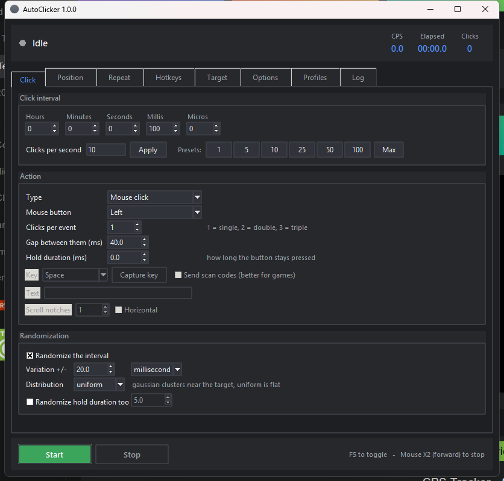
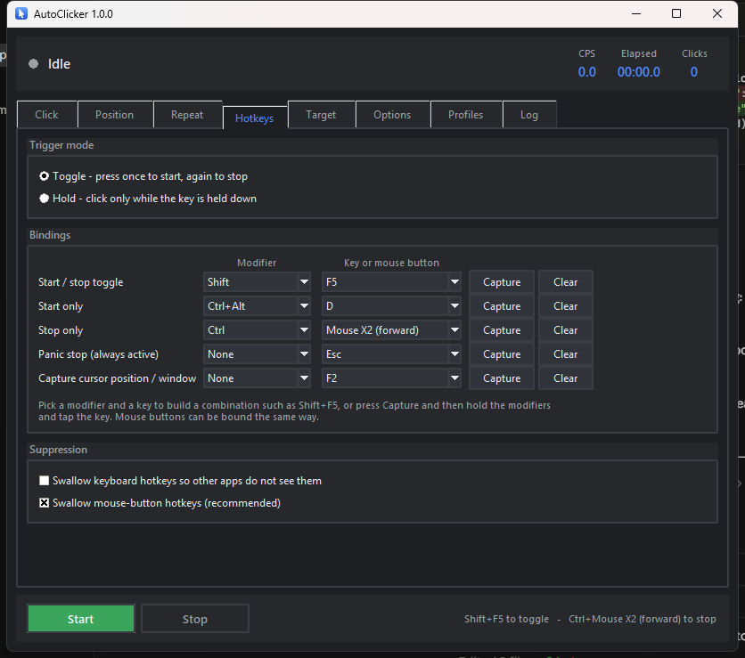

# AutoClicker

A full-featured auto clicker for Windows. Pure Python standard library — no
`pip install`, no bundled binaries. Input is injected with `SendInput`, hotkeys
come from real low-level hooks, and there is a proper system tray icon.

<br clear="left">



## Running it

**As an executable** — build a standalone `AutoClicker.exe` that needs no Python
installed:

```bash
python build_exe.py
```

That produces `dist/AutoClicker.exe` (~11 MB, one file, with the logo as its
icon). PyInstaller is installed into a local `build/venv`, so nothing is added
system-wide. `--onedir` builds a folder instead (starts faster), and `--console`
keeps a console window for debugging.

PyInstaller cannot build from MSYS2/MinGW Python, so the script finds a CPython
install itself (Microsoft Store, python.org, or the one running it) and tells
you what to install if there isn't one.

**From source:**

```bash
python main.py
```

Or double-click **`run.bat`** (no console window) / **`run-debug.bat`** (keeps a
console so errors are visible).

Requires Windows and Python 3.9+ with tkinter, which the python.org installer
includes by default. There is nothing to install.

```
python main.py --profile "Fast clicks"   # start with a saved profile
python main.py --start                   # begin clicking immediately
python main.py --minimized               # start hidden in the tray
```

The logo is generated from source rather than committed as an opaque blob —
`python tools/make_icon.py` re-renders `assets/*.ico` at 16 through 256 px.

## Settings

### Click interval
- Hours / minutes / seconds / milliseconds / **microseconds**
- Clicks-per-second field that stays in sync with the interval both ways
- One-touch presets: 1, 5, 10, 25, 50, 100 CPS, and **Max** (no delay)
- Randomize the interval by ± milliseconds or ± percent
- **Uniform** or **gaussian** distribution — gaussian clusters near the target
  value instead of spreading flat, which looks far less mechanical
- Randomize the hold duration independently

### Action
- Mouse button: **left, right, middle, X1 (back), X2 (forward)**
- Clicks per event: 1 (single), 2 (double), 3 (triple), up to 10
- Configurable gap between those clicks
- **Hold duration** — how long the button stays pressed
- Keyboard key press instead of a click, with a key picker or live capture
- Optional **scan codes** rather than virtual keys, which many games require
- Type a literal text string (layout-independent, via Unicode injection)
- Scroll wheel, vertical or horizontal, N notches at a time

### Position
- Click wherever the cursor already is
- Click a fixed screen coordinate, set by typing it, by "Use cursor", or by
  hovering the target and pressing the capture hotkey (works over other apps
  and full-screen windows)
- **Sequence of points** with per-point button, per-point delay override,
  label, and an enable/disable toggle for each
- Sequence order: **cycle, once, random, ping-pong**
- Random jitter around the target within a radius, distributed evenly over the
  disc rather than the bounding square
- Return the cursor to where it was after each click
- Cursor travel: instant, linear, or **smooth** (eased with slight wobble),
  with configurable duration and step count

### Repeat
- Until stopped / a fixed number of times / for a set duration
- Start delay before the first click
- **Burst mode**: N clicks, then a pause, repeating

### Hotkeys
- Separate bindings for **toggle, start, stop, panic stop, and position capture**
- **Modifier combinations built from dropdowns** — pick `Shift` and `F5` to get
  Shift+F5. All 16 combinations of Ctrl / Alt / Shift / Win are offered
- The key dropdown lists mouse buttons alongside keys, so `Ctrl+Mouse X2` is
  just as easy to set as `Ctrl+Shift+D`
- Or press **Capture** and type the combination: holding a modifier no longer
  ends the capture, so Shift-then-F5 records as Shift+F5, with live
  "Shift+…" feedback while you hold it
- **Toggle mode** (press to start, press to stop) or **hold mode** (clicks only
  while held)
- Optionally swallow the hotkey so the app underneath never sees it
- Conflict detection warns when two actions share a binding



### Target
- **Normal** — real input, wherever the cursor is
- **Only while the target window is focused** — clicks pause automatically when
  you alt-tab away, and resume when you come back
- **Background** — posts messages straight to the window, so it can be
  minimised or behind other windows and your real cursor is never touched
- Window picker by list, or by hovering it and pressing the capture hotkey
- Match by title so the target is re-found after the app restarts
- Posts to the child control under the point, which is what makes background
  clicking actually work on most applications

### Options
- Always on top, minimize to tray, close to tray, start minimized
- Dark and light themes
- High-precision waiting, 1 ms timer resolution, process priority
- Keep the display awake while running
- Beep on start/stop, confirm before quitting mid-run
- Automatic save on exit

### Profiles
Save, load, overwrite, delete, plus JSON import/export for sharing a setup.
Settings live in `%APPDATA%\AutoClicker\`.

### Live feedback
Status indicator, total clicks, events, skipped events, elapsed time, and the
**measured** clicks per second, plus a timestamped activity log.

## How the timing works

Naive auto clickers drift, because they sleep for the interval *after* doing
the work. This one schedules on absolute deadlines (`next_at += interval`), so
the time spent clicking is absorbed rather than added.

The bigger trap on Windows is wait resolution. `threading.Event.wait()` is
quantised to the ~15.6 ms scheduler tick — ask for 10 ms and you get 15.6 ms,
so a "100 CPS" clicker silently runs at 64 CPS. Since Python 3.11 `time.sleep()`
is backed by a high-resolution waitable timer and lands within ~0.5 ms, so the
engine sleeps in short chunks (re-checking the stop flag between them) and
spin-waits only the final ~1.5 ms.

Measured on the development machine:

| Requested | Measured mean | Std. dev. | Worst deviation |
|-----------|---------------|-----------|-----------------|
| 10 ms (100 CPS) | 10.026 ms | 0.028 ms | 0.182 ms |
| 1 ms (1000 CPS) | 2000 clicks in 2.004 s | — | — |
| no delay | ~119,000 CPS | — | — |

Stop latency is under 10 ms even when the interval is 30 seconds.

One consequence worth knowing: **hold duration is a speed limit**. A 10 ms hold
caps you at 100 CPS no matter what interval you set, because each click cannot
finish sooner. That is why the default hold is 0 ms.

## Limitations

- **Background mode does not work everywhere.** It posts `WM_*BUTTONDOWN/UP`,
  which ordinary Win32 controls handle, but software reading raw input or
  DirectInput ignores posted messages entirely. Most full-screen games are in
  that group — use Normal mode for them.
- **Elevated windows need an elevated clicker.** Windows blocks input from a
  normal-privilege process to a window owned by an administrator process. Run
  the app as administrator if the target is elevated; it tells you which mode
  it is running in on the Options tab.
- Anti-cheat systems can detect injected input. Nothing here tries to hide from
  them, and the randomization options exist for feel, not evasion.

## Layout

```
main.py                 entry point and command-line arguments
build_exe.py            PyInstaller build, in an isolated venv
autoclicker/
    winapi.py           ctypes bindings: SendInput, hooks, DPI, window lookup
    config.py           settings dataclass, validation, JSON, profiles
    engine.py           the click worker thread and its timing
    hotkeys.py          global keyboard + mouse hooks, capture, dispatch
    tray.py             Shell_NotifyIcon tray icon and generated .ico files
    gui.py              tkinter interface
tools/make_icon.py      renders assets/*.ico from scratch
assets/                 the generated logo, bundled into the exe
tests/                  four suites, see below
```

Threading: the engine and the hotkey dispatcher never touch widgets. They push
onto a queue that the Tk thread drains every 50 ms, which is also why a
1000 CPS run does not flood the event loop — statistics are polled, not pushed.

## Tests

```bash
python tests/run_all.py
```

Four suites, 90+ assertions:

| Suite | What it proves |
|-------|----------------|
| `test_engine.py` | Interval accuracy and drift, every repeat/burst/sequence limit, randomization bounds and distribution shape, jitter geometry, cursor restore, stop latency, config round-trip and recovery from malformed JSON |
| `test_hotkeys.py` | Real `SendInput` key presses travelling through the live global hook into the engine: matching, modifiers, auto-repeat suppression, capture, pause, hold mode, and that self-injected clicks are ignored |
| `test_real.py` | A genuine Win32 window with `BUTTON` and `EDIT` children counting what it actually receives — background clicks with the cursor untouched, typing, scrolling, multi-point sequences, and real injected clicks |
| `test_gui.py` | Every tab renders, mode switching enables the right widgets, CPS↔interval sync, point list editing, profile save/load, dialogs, and clean shutdown |

`test_real.py` and `test_hotkeys.py` inject genuine input — a few clicks onto a
throwaway window they create themselves, and F13/F14 key presses. Nothing is
sent to any other application, but don't type while they run.

The engine suite asserts on real elapsed time (for example "mean within 0.5 ms
of 10 ms"), which is what caught the `Event.wait` problem above. That tightness
means it can wobble if the machine is busy — if a timing check fails, re-run it
on an idle system before believing it.
